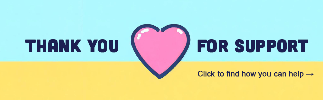

  

---

## 👋 Hi there!

My name is **Oleksii** and I do open source for fun.
The projects you will find on this profile are just random things I've built at one point or another to make my life easier.
Hopefully they can be useful to you as well.

- To see the list of my most popular projects, [visit my website](https://tyrrrz.me/projects).
- If you want to contact me, join my [Discord server](https://discord.gg/2SUWKFnHSm) or tag me on [Twitter](https://twitter.com/Tyrrrz).

### Socials

### Stats

  
  

