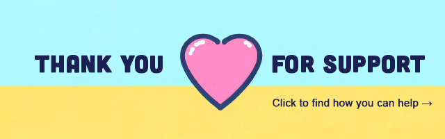

  

---

## 👋 Hi there!

My name is **Oleksii** and I do open source for fun.
The projects you will find on this profile are just random things I've built at one point or another to make my life easier.
Hopefully they can be useful to you as well!

- To see the list of my most popular projects, [visit my website](https://tyrrrz.me/projects).
- To support the development of my projects, consider [donating](https://tyrrrz.me/donate).
- To contact me, join my [Discord server](https://discord.gg/2SUWKFnHSm) or tag me on [Bluesky](https://bsky.app/profile/tyrrrz.me).

Currently, I'm serving in the AFU so I may be (very) slow to respond.
Plesae keep that in mind when opening issues or messaging me.

  

    <h2>Stats</h2>
  

  
  

